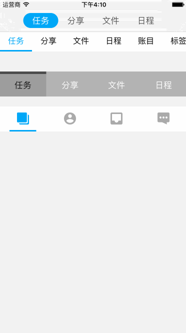

# SegmentedControl
SegmentedControl is a highly customizable segmented control for  iOS applications. 



## How To Get Started
### Carthage
Specify "SegmentedControl" in your ```Cartfile```:
```ogdl 
github "teambition/SegmentedControl"
```

### Usage
####  Text
```swift
let titles: [NSAttributedString] = ...
let selectedTitles: [NSAttributedString] = ...

// for storyboard
segmentedControl.setTitles(titles, selectedTitles: selectedTitles)
// programmatically
let segmentedControl = SegmentedControl.initWithTitles(titles, selectedTitles: selectedTitles)

// assign delegate
segmentedControl.delegate = self

// configure selection box if needed, the default style is 'none'
segmentedControl.selectionBoxStyle = .default
segmentedControl.selectionBoxColor = UIColor(white: 0.62, alpha: 1)
segmentedControl.selectionBoxCornerRadius = 15 // default is 0
segmentedControl.selectionBoxEdgeInsets = UIEdgeInsets(top: 0, left: 20, bottom: 0, right: 20) // default is UIEdgeInsets.zero

// configure selection indicator if needed, the default style is 'none'
segmentedControl.selectionIndicatorStyle = .top
segmentedControl.selectionIndicatorColor = UIColor(white: 0.3, alpha: 1)
segmentedControl.selectionIndicatorHeight = 3 // default is 5
segmentedControl.selectionIndicatorEdgeInsets = UIEdgeInsets(top: 0, left: 20, bottom: 0, right: 20) // default is UIEdgeInsets.zero
```

####  Image
```swift
let images = ...
let selectedImages = ...

// for storyboard
segmentedControl.setImages(images, selectedImages: selectedImages)
// programmatically
let segmentedControl = SegmentedControl.initWithImages(images, selectedImages: selectedImages)

// assign delegate
segmentedControl.delegate = self

// configure selection box if needed, the default style is 'none'
segmentedControl.selectionBoxStyle = .default
segmentedControl.selectionBoxColor = UIColor.lightGray
segmentedControl.selectionBoxCornerRadius = 15 // default is 0
segmentedControl.selectionBoxEdgeInsets = UIEdgeInsets(top: 0, left: 20, bottom: 0, right: 20) // default is UIEdgeInsets.zero

// configure selection indicator if needed, the default style is 'none'
segmentedControl.selectionIndicatorStyle = .bottom
segmentedControl.selectionIndicatorColor = UIColor.darkGray
segmentedControl.selectionIndicatorHeight = 3 // default is 5
segmentedControl.selectionIndicatorEdgeInsets = UIEdgeInsets(top: 0, left: 20, bottom: 0, right: 20) // default is UIEdgeInsets.zero
```

####  Implement delegate
```swift
func segmentedControl(_ segmentedControl: SegmentedControl, didSelectIndex selectedIndex: Int) {
    // do something
}

func segmentedControl(_ segmentedControl: SegmentedControl, didLongPressIndex longPressIndex: Int) {
    // do something
}
```

## Minimum Requirement
iOS 8.0

## Release Notes
* [Release Notes](https://github.com/teambition/SegmentedControl/releases)

## License
SegmentedControl is released under the MIT license. See [LICENSE](https://github.com/teambition/SegmentedControl/blob/master/LICENSE.md) for details.

## More Info
Have a question? Please [open an issue](https://github.com/teambition/SegmentedControl/issues/new)!
